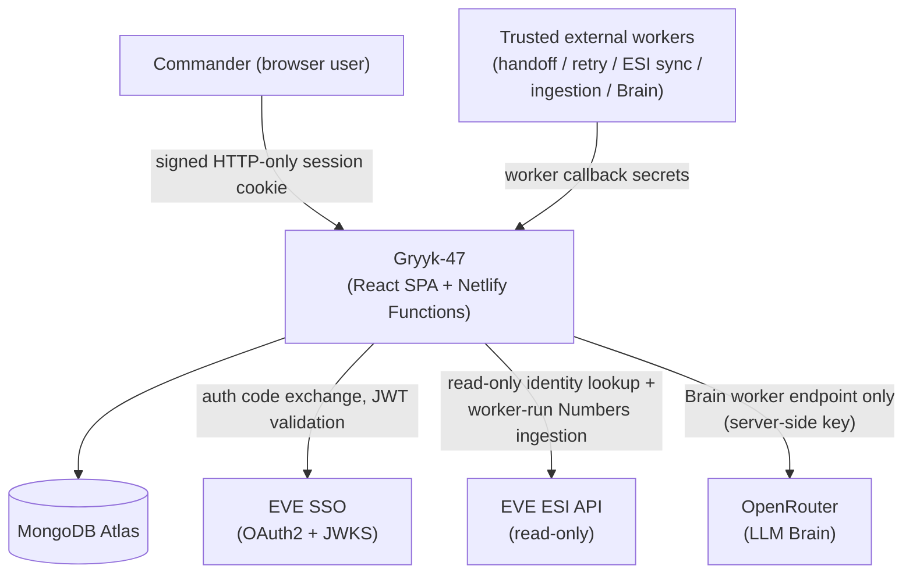
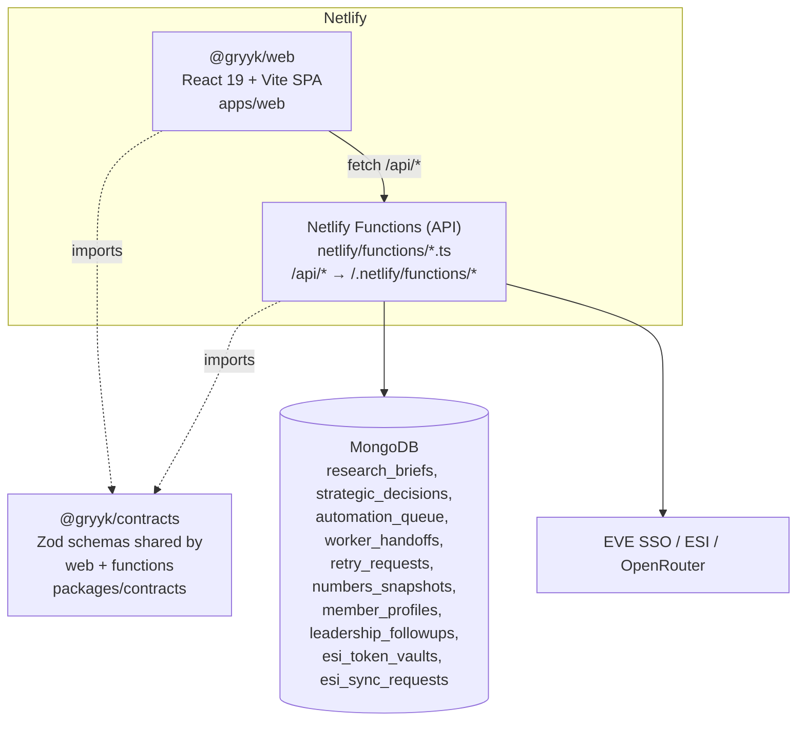
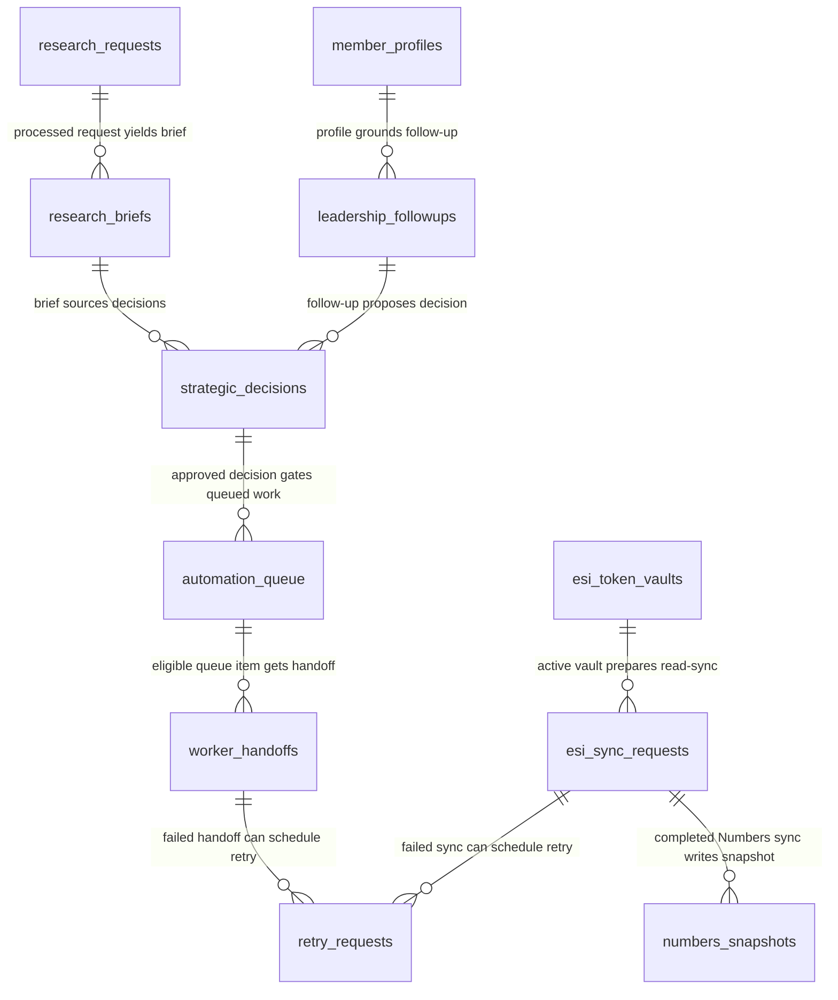
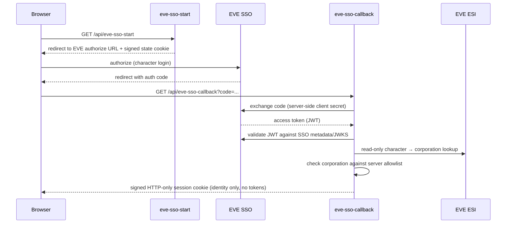
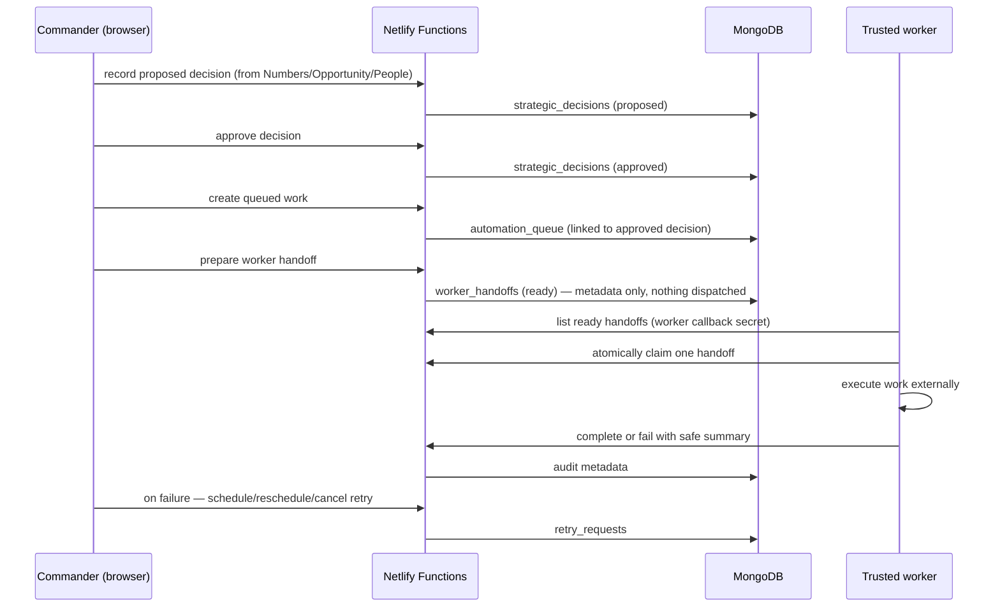
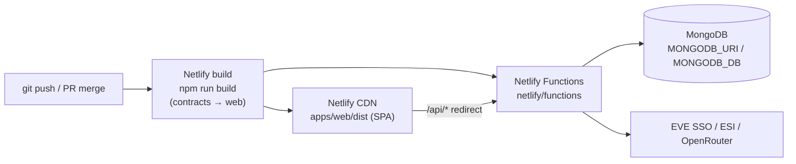

# Gryyk-47 Greenfield — architecture overview

Generated onboarding doc. Diagrams are Mermaid — they render natively on GitHub.

Gryyk-47 is a command operating system for an EVE Online corporation. The core design
constraint, repeated throughout the codebase: the **browser is a command and review
surface only**. It never dispatches workers, fetches ESI, writes to EVE, or calls
external services. All execution happens through trusted workers authenticating with
callback secrets, and all player-impacting work is gated behind explicit commander
approval of decision records.

## System context



The commander signs in via EVE SSO; sessions are authorized only for corporations in a
server-owned allowlist (`EVEONLINE_CORPORATION_ID` / `EVEONLINE_AUTHORIZED_CORPORATION_IDS`).
Workers are external processes that poll worker-only API endpoints; the app never pushes
work to them.

## Containers



- **@gryyk/web** — the command center UI. One route per surface (Command Brief,
  Decision Records, Automation Queue, Numbers, Opportunity, People, ESI Sync,
  Operations Health, Production Evidence), each backed by a feature module in
  `apps/web/src/features/`.
- **Netlify Functions** — one function per surface plus worker callback endpoints
  (`*-worker.ts`) and EVE SSO endpoints. Shared logic (Mongo access, auth scope,
  normalizers, per-domain stores, worker callback auth) lives in
  `netlify/functions/_shared/`.
- **@gryyk/contracts** — Zod schemas defining every API payload; both sides validate
  against the same definitions.

## Data model

MongoDB (document store) — no migrations, so this is reconstructed from the store
modules in `netlify/functions/_shared/` and the README. Not exhaustive; shows the
central decision/execution chain and the domain collections.



Key invariants enforced in the store/rules modules: queue records require an approved
decision; only one active scheduled retry per target; vault token material is sealed
server-side (`ESI_TOKEN_VAULT_SEALING_KEY`) and never returned to the browser.

## Key flows

### EVE SSO sign-in



In production (`NODE_ENV=production` or Netlify `CONTEXT=production`) all command APIs
require this signed session; locally, `EVEONLINE_CORPORATION_ID` provides a no-session
fallback scope for fixtures and tests.

### Decision → queue → worker handoff lifecycle



Every step is a separate explicit commander action; approval never auto-creates queue
work, and preparation never auto-dispatches.

## Deployment



Single Netlify site: static SPA plus functions, wired by the `/api/*` redirect in
`netlify.toml`. Secrets (Mongo, worker callback secrets, EVE SSO client secret,
OpenRouter key, vault sealing key) are server-side Netlify env vars — never `VITE_*`.
Local development mirrors this with `npm run dev:netlify` on port 8888.

## Codebase map

```
apps/web/              React 19 + Vite command-center SPA
  src/routes/          One route component per command surface
  src/features/        Feature modules (command-brief, decision-records, numbers,
                       opportunity, people, esi-sync, automation-queue,
                       operations-health, production-evidence, retry-audit, session)
  e2e/, tests/         Playwright smoke tests and web unit tests
netlify/functions/     API endpoints, one file per surface or worker callback
  _shared/             Mongo client, auth scope, session cookies, EVE SSO,
                       per-domain stores/normalizers/rules, worker callback auth
packages/contracts/    @gryyk/contracts — Zod schemas for every API payload
docs/                  roadmap, production readiness/operations, worker policy
specs/                 Spec Kit feature specs (numbered milestones, e.g. 057-...)
.specify/              Spec Kit constitution and memory
.agents/               Agent skill definitions for the spec workflow
netlify.toml           Build config + /api/* → functions redirect
playwright.config.ts   E2E config (deterministic fixtures, no live credentials)
jest.config.cjs        Contract/unit tests run in Node
```

## Open questions

- The ERD is inferred from store modules and README prose, not a schema — field-level
  relationships (e.g. exactly how `retry_requests` references its target) should be
  confirmed against `_shared/*-store.ts`.
- The README mentions a broader legacy `gryyk47` database alongside the runtime
  `MONGODB_DB`; whether any runtime path reads it wasn't verified here.
- `brain-worker.ts` (OpenRouter Brain) writes `research_briefs`/`research_requests` —
  the exact trigger cadence for Brain runs (manual worker? scheduled externally?) is
  worker-owned and not visible in this repo.
- Production Evidence records presumably live in their own collection
  (`production-evidence-store.ts`); the collection name wasn't confirmed.
